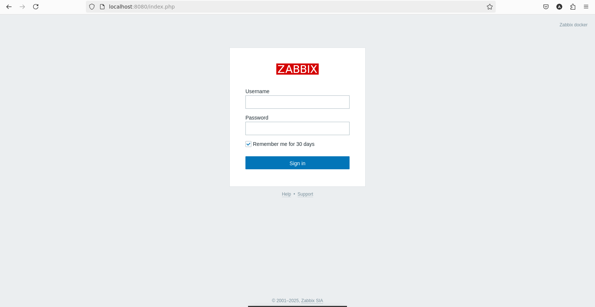
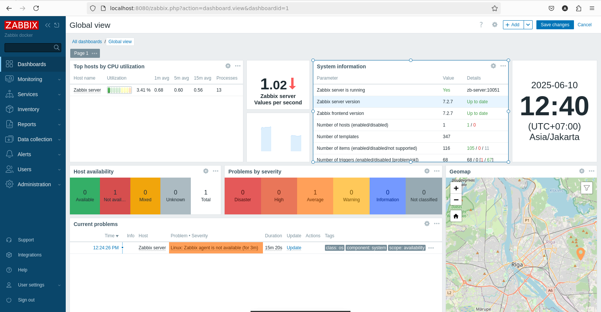

# Zabbix

## The universal, open-source observability solution for IT & OT

Monitor everything - the cloud, networks, services, IoT, and more. Available on-premise or in the cloud. Anytime, anywhere.

- Implementation in Podman
- Run command file `sh run-zabbix.sh`

Login

Dashboard

